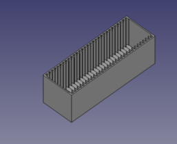
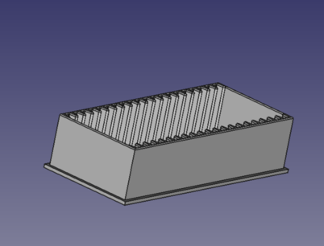

# Labequipment
Misc. Lab equipment

## Substrate Sleds

Sled Designs to carry Substrates.
### Substrate Sled High
[Taking substrates out by tweezer.](https://github.com/cbaretzky/Labequipment/tree/main/SubstrateSled/SubstrateSledHigh)

### Substrate Sled Low
[Taking substrates out by hand.](https://github.com/cbaretzky/Labequipment/tree/main/SubstrateSled/SubstrateSledLow)

